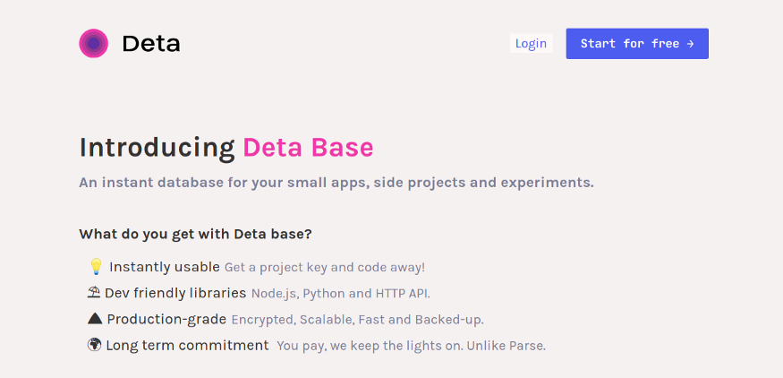
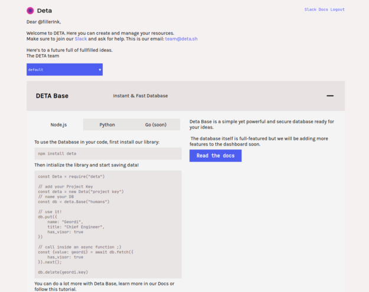

+++
author = "Sreeram Venkitesh"
date = 2020-06-21
title = "The Definitive Guide to using Deta Base"
series = 'software'

+++

[deta.sh](https://deta.sh) is a cloud platform, or as the developers @ Deta say, “a cloud computer”. What makes Deta stand out from other cloud platforms is that it is built with developer and user experience as the first priority.
In this article, we are gonna look at how we can get up to speed with using Base, the NoSQL database from Deta with literally zero hassle to set up.




### Signing In

Upon signing in to Deta, you’ll be prompted to create an account if you haven’t already, by giving your username, email and password.

In the dashboard, you can see which project you are currently in.

By logging in for the first time, you will be in a default project. You will be shown the **project key** for the default project when you sign in. Copy this code and save it somewhere because it will be shown only once.

Once you’ve done that you can use the boilerplate code that is given in the dashboard, for using Deta with Node.js or Python. You can install the package into your project with ```npm install deta``` or ```pip install deta``` respectively and you can start using Deta.

> Deta Base can be used really easily to set up databases for small projects, building at hackathons where you want to get stuff done quickly or by beginners who are just learning about databases.




### Using Base with JavaScript

Setting up a Base is as simple as creating a deta object with your project key! You can start writing into and reading from your database right away. Let us see how we can do this.

In your JavaScript file, first import the package

```
const Deta = require("deta")
```

Add your project key to the object

```
const deta = new Deta("project key")
```

Now you can create a new database using ```deta.Base()``` . The interesting thing about Deta is that you can have an unlimited number of Bases within your project, and each Base is equivalent to a new database.

Let’s create a sample Base and write some values into it.

```
const db = deta.Base("humans")
```

Now that we create a new database named humans, we can read/write data with it.

```
db.put({     
  name: "Geordi",     
  title: "Chief Engineer",     
  has_visor: true 
})
```

The ```db.put()``` function will write a value into the database. You can pass the data as key value pairs according to your need. Once you create the Base object with a specific name, the next time you run the same code or create a db with a same name in another file or project the same database will be used (as long as you are using the same project key). This makes it really flexible for us to use the same database from different locations.

Another method that comes with the Base object is ```get()```. It can be used to retrieve an entry from the database which has a certain key value. In the below example, we are reading the db and retreiving the entry which has a key value of ‘one’.

```
const item = await db.get('one');
```

You can refer to the [docs](https://docs.deta.sh/docs/lib) to know more about the different functions you get with the deta library to manipulate the database.

### So what makes Deta Base special?

Deta Base can be used really easily to set up databases for small projects, building at hackathons where you want to get stuff done quickly or by beginners who are just learning about databases.

If incase you’re worried about the security, all the data that you store with Base is safely encrypted and stored in AWS.

Check out [deta.sh](https://deta.sh) where you can avail an early bird offer with unlimited bases, 3GB of storage and 30k ops per month for free right now!

Say hi to the people at deta @ [Twitter](https://twitter.com/detahq) and [Slack](https://deta-hq.slack.com/)