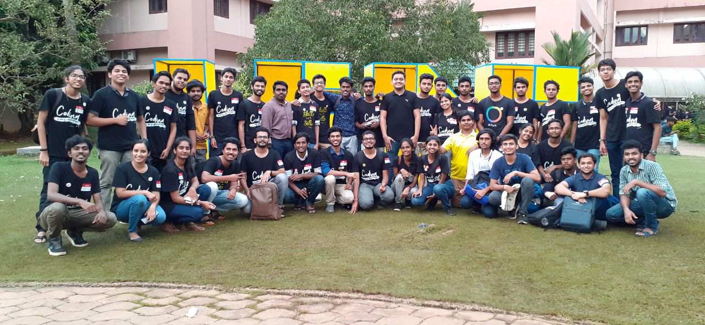
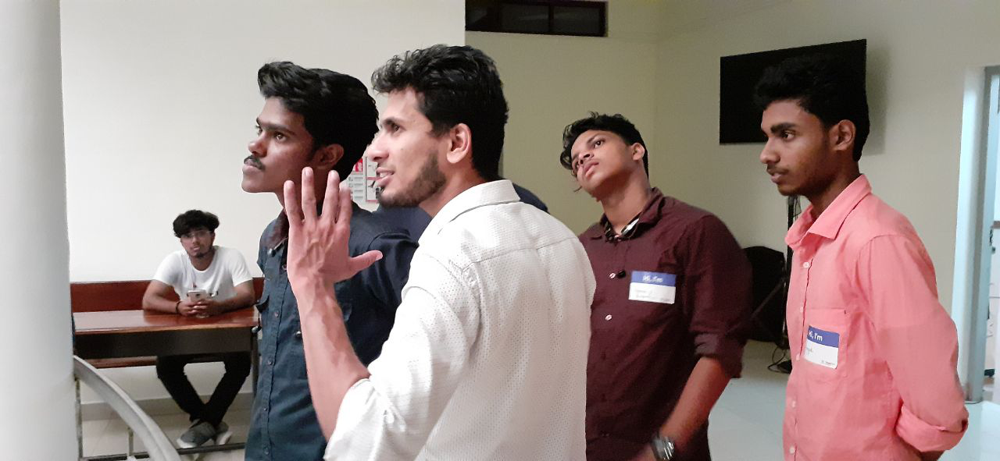
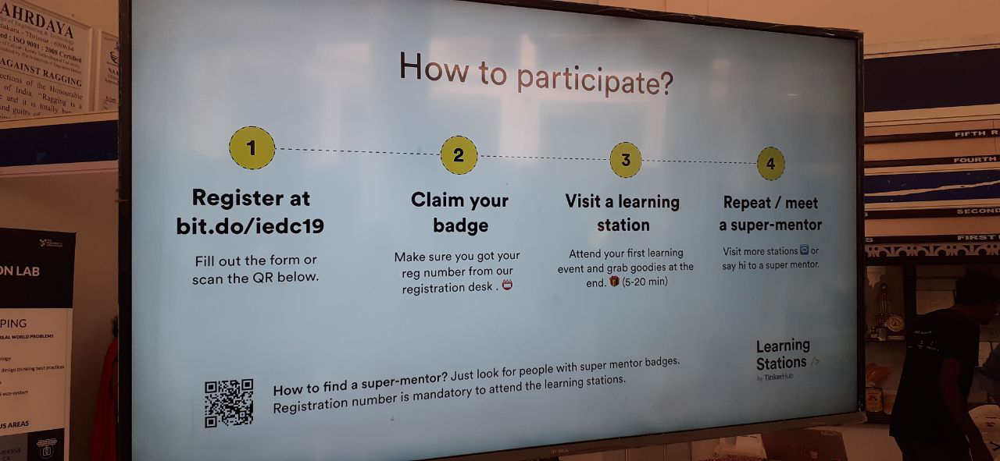
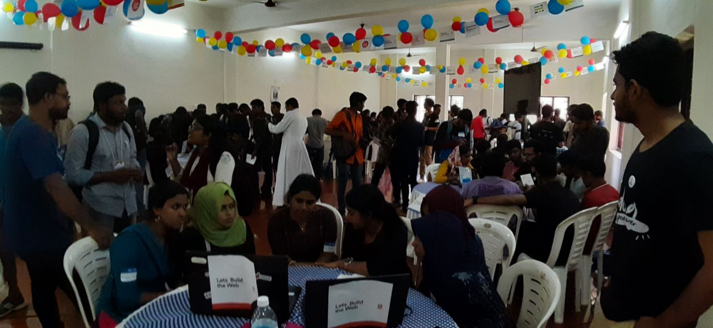
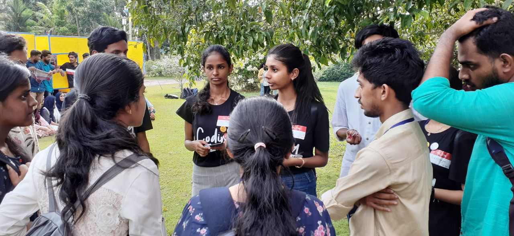
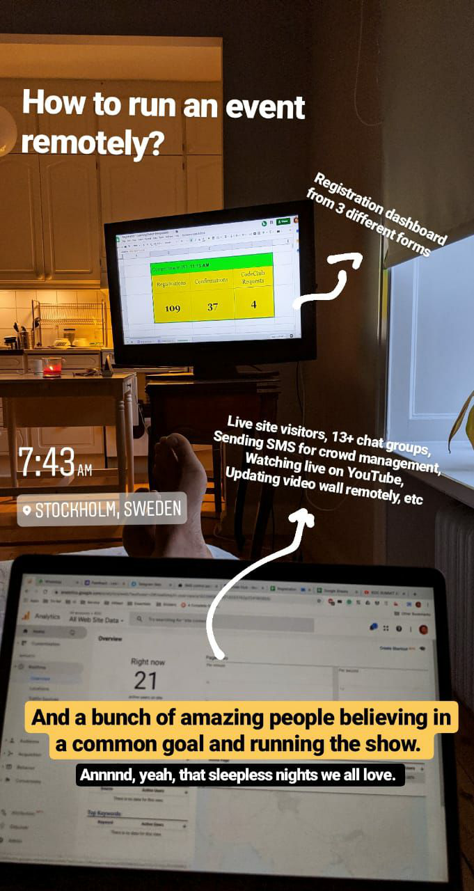

+++
author = "Sreeram Venkitesh"
date = 2019-10-25
title = "TinkerHub @ IEDC Summit"
series = 'community'

+++

IEDC Summit is a yearly event where the **Innovation and Entrepreneurship Development Cells (IEDCs)** from colleges all over Kerala come together for a day to learn and grow. The events range from startup expos to workshops to power talks. This year, IEDC Summit witnessed something no other event has seen before — A novel way of learning and teaching, where over **750 students participated and learned something new in just 6 hours. The TinkerHub Learning Stations!**

The story I have to tell starts last week, with a call from Ashfaque, TinkerHub’s Chief Operations Officer. All I knew was that TinkerHub was setting up a stall at the summit. Volunteers were needed. I was glad to skip class on Friday and head to Sahradaya College of Engineering, Kodakara.

I reached there by around 2 pm and was waiting for the others to arrive. The college was getting ready for the big event tomorrow. All the students and volunteers were already buzzing around. It was an exciting scene!

I later met with the team — Vineeth, Jewel, Vighnesh, Anugeeth, Nishal along with Ashfaque and Kurian leading us. We went to our space, to set everything up for the D-Day. We had spaces in 3 floors, a registration desk cum pavillion in the ground floor, a complete room and two other stations on the first floor, and a hallway on the second floor.

The volunteers at Sahrdaya were super helpful. They moved all the tables and chairs into the rooms for us! We then started our job of setting up the learning stations. It was only by this time I had actually got an idea of what was going on, and what the learning stations were. Learning stations were similar to what we had done with learning circles during one of our monthly TinkerDays, but only on the ninth gear this time around!

The major work we had to do was set up the ambience of the place. Colourful, yet serious. Interesting, yet intriguing. Like a classroom, yet fun and engaging. We had all night to do it, but we had to do it properly. This would be the centre of attraction.

The different tables were allotted for the different fields of study, where mentors and super-mentors will be present to help the incoming students get started with the field. Each topic had two different stations, a beginner and an advanced one.

The volunteers had moved in all the tables and helped us set up the stalls downstairs, now it was time to get the learning stations up as Kurian and Ashfaque had envisioned. We had used the balloons of yellow, red and blue, the colours from the TinkerHub logo made the entire room stand out.

I stayed up to around 1 am after which I had started to doze off, after which I went back to the room. By this time, we had arranged the main hall and had moved upstairs. The hall looked beautiful!

The number of people who turned up was enormous! Over 750 students turned up at our Learning Stations in just around 6 hours! The crowd was so tough that even us photographers found it difficult to move through the place!

Even after lunch, when everyone was tired, people were coming to our Learning Stations. This picture of the Machine Learning Station, lead by Jaiden from the team, was taken at 2 in the afternoon while everyone was slowing down after lunch.

We also had a fun zone, where there were games and other fun activities with a lot of swags to be won! Students who hadn’t known of TinkerHub of the events that we were doing came to know about it through these fun games.

And as all good things have to end sometime, this day also had to come to an end. With an official team meeting led by Ashfaque, the event was concluded and we went on to take the mandatory group picture.

Speaking of organising events, a HUGE shout out to Abid, who was working 24/7 all the way from Sweden to conduct this event here in Kerala!

> In the end all we have are some memories and the satisfaction that we were able to touch the lives and hearts of quite some people.

I really hope that all the students who were new to TinkerHub keep going on the path that they were set into yesterday and that they join us for our future meetups. The community is strong only because of the people in it.