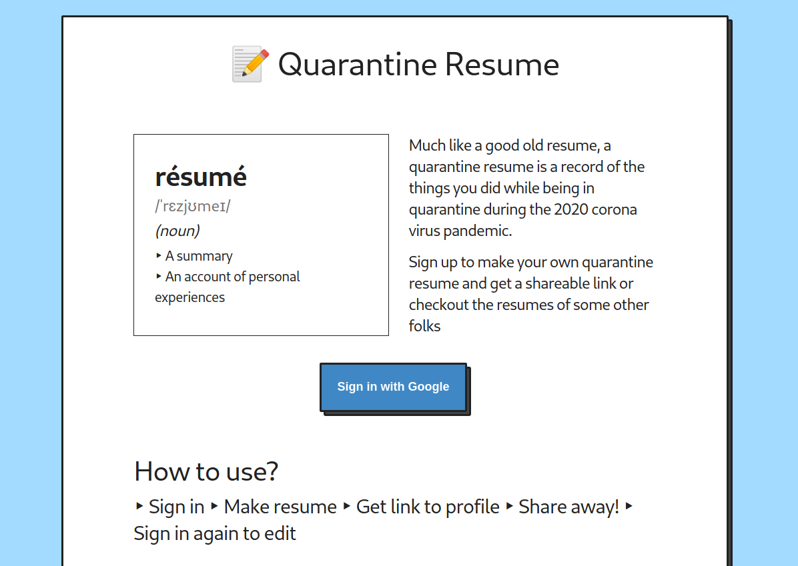
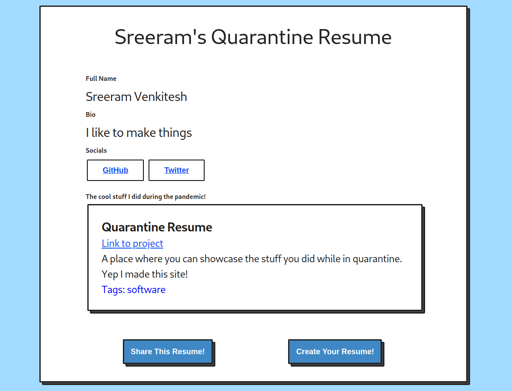

+++
author = "Sreeram Venkitesh"
date = 2020-06-20
title = "How and Why I made quarantineresu.me"
series = 'projects'

+++

The coronavirus pandemic that we are going through right now is unlike all the other pandemics that have occurred throughout the history of humankind. This is the first of such a situation where all of us are still connected to each other through the wonderful technology of the internet.

With all the schools and universities closed down and having to switch to online or remote classes, the lives of students and the education industry have been the most affected. With lockdown instantiated in many countries, a lot of students found themselves sitting at their homes waiting to meet their peers and teachers through Zoom or Google Meet and tons of free time at their disposal.

Me too, being such a student had this idea of creating myself a 'quarantine resume' of sorts where I specifically list down all the stuff I did during this lockdown period. This was logical because obviously, I couldn't fit all of them into my actual resume. The quarantine resume could stand separate and I can even pack it up with my regular resume if I wanted to. People have had luck finding jobs and internships in the past with such different iterations of the concept of resume, such as the failure resume. The failure resume or the rejection resume is a record of all the things you've failed at or have been rejected. If people can get jobs with a failure resume, why not a quarantine resume - I thought.

Then again, if my quarantine resume had to make sense, people should've heard of it before. So I thought it would be a better idea to create a platform where anyone can build their own quarantine resume.

That is how I came up with [quarantineresu.me](https://quarantineresu.me). A really simple website where anyone can sign in with their Google accounts and create their resume by adding information like their names, bio, links to social media and all the work they did during the pandemic.

### Specifics
* The site runs on a Node.js backend with Express
* For the frontend, I used [blocks.css](https://thesephist.github.io/blocks.css/)
* [Deta Base](https://deta.sh/) is used as the database to store the resume details. It's a really really simple database with zero hassle to set up. Deta can be used easily in such small projects or hackathons even if you have minimal knowledge about databases

You can check out the live site at [quarantineresu.me](https://quarantineresu.me) and make a resume for yourself if you want to! Else, you can check out the profiles of the top hackers from our community featured on the home page as well.

Also, check out Quarantine Resume at ProductHunt at [here](https://www.producthunt.com/posts/quarantine-resume)

